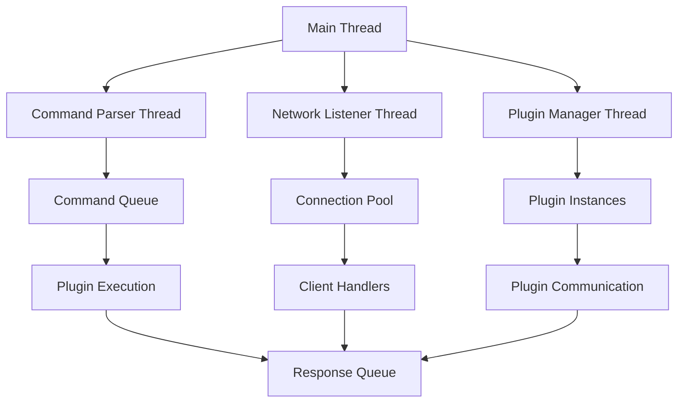

# 🤖 HelenaBot

[← Volver al portafolio](../)

## 📋 Descripción del Proyecto

**Bot modular de automatización** desarrollado en PureBasic para experimentos de automatización y respuesta a comandos en entornos locales. El proyecto explora las capacidades de networking de bajo nivel y multi-threading para crear un sistema de bot eficiente y personalizable.

## ✨ Características Principales

### 🔧 Arquitectura Modular
- **Sistema de plugins** - Módulos intercambiables para diferentes funcionalidades
- **Command parsing** - Intérprete de comandos flexible y extensible
- **Event-driven architecture** - Respuesta asíncrona a eventos del sistema
- **Configuration management** - Sistema de configuración dinámico

### 🌐 Networking Avanzado
- **Socket networking** - Comunicación TCP/UDP de bajo nivel
- **Multi-protocol support** - HTTP, WebSocket, TCP custom protocols
- **Connection pooling** - Gestión eficiente de múltiples conexiones
- **Network monitoring** - Diagnóstico y logging de actividad de red

### ⚡ Multi-Threading
- **Thread pool management** - Gestión optimizada de hilos de ejecución
- **Concurrent processing** - Manejo simultáneo de múltiples tareas
- **Inter-thread communication** - Sistema de mensajes entre hilos
- **Resource synchronization** - Prevención de race conditions

## 🛠️ Stack Tecnológico

```purebasic
; Tecnologías y características principales
Structure TechStack
    Language.s        ; PureBasic
    Networking.s      ; TCP/UDP Sockets
    Threading.s       ; Multi-threading nativo
    Architecture.s    ; Modular plugin system
    Platform.s        ; Windows/Linux compatible
EndStructure

; Módulos del sistema
Enumeration Modules
    #ModuleCore       ; Core del bot
    #ModuleNetwork    ; Networking
    #ModuleCommands   ; Command parser
    #ModulePlugins    ; Plugin manager
    #ModuleLogging    ; Sistema de logs
EndEnumeration
```

## 🎯 Arquitectura del Sistema

### **1. Core Engine**
```purebasic
; Motor principal del bot
Procedure BotMainLoop()
    Protected Event
    
    Repeat
        Event = WaitWindowEvent(100)
        
        ; Procesar comandos pendientes
        ProcessCommandQueue()
        
        ; Manejar conexiones de red
        HandleNetworkEvents()
        
        ; Ejecutar plugins activos
        ExecuteActivePlugins()
        
    Until Event = #PB_Event_CloseWindow
EndProcedure
```

### **2. Sistema de Comandos**
```purebasic
; Parser de comandos flexible
Structure Command
    Name.s
    Parameters.s
    Source.s
    Timestamp.l
EndStructure

Procedure ParseCommand(Input.s)
    Protected NewList Commands.Command()
    
    ; Análisis y validación del comando
    ; Routing a módulo apropiado
    ; Ejecución con parámetros
    
    ProcedureReturn @Commands()
EndProcedure
```

### **3. Plugin System**
```purebasic
; Sistema de plugins dinámico
Interface IPlugin
    Initialize()
    Execute(Command.s)
    Cleanup()
    GetInfo.s()
EndInterface

; Plugin example
Structure EchoPlugin Extends IPlugin
    Name.s
    Version.s
EndStructure
```

## 📡 Módulos de Funcionalidad

### **Networking Module**
- **TCP Server** - Servidor para conexiones entrantes
- **HTTP Client** - Requests HTTP para APIs externas
- **WebSocket support** - Comunicación bidireccional en tiempo real
- **SSL/TLS** - Conexiones seguras para datos sensibles

### **Command Module**
- **Natural language parsing** - Interpretación básica de lenguaje natural
- **Alias system** - Comandos abreviados y personalizados
- **Parameter validation** - Validación de argumentos de comandos
- **Help system** - Documentación automática de comandos

### **Automation Module**
- **File system operations** - Manipulación de archivos y directorios
- **Process management** - Lanzamiento y control de procesos
- **System monitoring** - Vigilancia de recursos del sistema
- **Scheduled tasks** - Ejecución programada de tareas

## 🔧 Configuración y Personalización

### **Archivo de Configuración**
```ini
[Bot]
Name = HelenaBot
Version = 1.0
Debug = True

[Network]
Port = 8080
MaxConnections = 50
Timeout = 30000

[Plugins]
AutoLoad = echo,file,system
PluginPath = ./plugins/

[Logging]
Level = INFO
File = helena.log
MaxSize = 10MB
```

### **Sistema de Plugins**
```purebasic
; Plugin de ejemplo - Echo
Procedure EchoPlugin_Execute(Command.s)
    Protected Response.s
    
    Response = "Echo: " + Command
    
    ; Enviar respuesta al cliente
    SendResponse(Response)
EndProcedure

; Registro del plugin
RegisterPlugin("echo", @EchoPlugin_Execute())
```

## 🎮 Casos de Uso

### **Automatización de Tareas**
- **File organization** - Organización automática de archivos
- **Backup scheduling** - Programación de respaldos
- **System maintenance** - Tareas de mantenimiento del sistema
- **Process monitoring** - Vigilancia de aplicaciones críticas

### **Home Automation**
- **Device control** - Control de dispositivos IoT locales
- **Environmental monitoring** - Sensores de temperatura, humedad
- **Security system** - Cámaras y sensores de seguridad
- **Lighting control** - Automatización de iluminación

### **Development Tools**
- **Build automation** - Compilación automática de proyectos
- **Testing framework** - Ejecución de tests automatizados
- **Code deployment** - Deploy automático a servidores
- **Development environment** - Configuración de entornos

## 📊 Arquitectura de Threading



## 🛡️ Seguridad y Robustez

### **Control de Acceso**
```purebasic
; Sistema de autenticación simple
Structure Client
    IP.s
    Authenticated.b
    Permissions.l
    LastActivity.l
EndStructure

Procedure AuthenticateClient(*Client.Client, Token.s)
    ; Validación de token
    ; Asignación de permisos
    ; Logging de acceso
EndProcedure
```

### **Medidas de Seguridad**
- **Token-based authentication** - Autenticación por tokens
- **Permission system** - Control granular de permisos
- **Rate limiting** - Prevención de spam y ataques
- **Input sanitization** - Validación de entradas de usuario
- **Audit logging** - Registro completo de actividades

## 🔧 Instalación y Configuración

### **Requisitos del Sistema**
```
Sistema Operativo: Windows 7+ / Linux
RAM: Mínimo 256MB
Espacio: 50MB libres
Red: Conexión opcional para funciones remotas
```

### **Compilación desde Fuente**
```bash
# Clonar repositorio
git clone https://github.com/4rgs/helenaBot.git
cd helenaBot

# Compilar con PureBasic
pbcompiler helena_bot.pb

# Ejecutar
./helena_bot
```

### **Configuración Inicial**
```purebasic
; Primera ejecución - configuración automática
If FileSize("config.ini") = -1
    CreateDefaultConfig()
    ShowWelcomeMessage()
EndIf
```

## 📈 Roadmap y Desarrollo

- [ ] **Web interface** - Panel de control via navegador
- [ ] **Plugin marketplace** - Repositorio de plugins comunitarios  
- [ ] **Database integration** - Soporte para SQLite/PostgreSQL
- [ ] **API REST** - Interface REST para integraciones
- [ ] **Mobile companion** - App móvil para control remoto
- [ ] **Machine learning** - Módulos de ML para automatización inteligente

## 🎯 Filosofía del Proyecto

> **Experimentación con PureBasic** - Explorar las capacidades de este lenguaje único para sistemas de bajo nivel y networking.

> **Modularidad** - Cada funcionalidad como un módulo independiente para máxima flexibilidad.

> **Performance** - Aprovechar la velocidad nativa de PureBasic para operaciones críticas.

## 🔗 Enlaces

- **[📁 Repositorio GitHub](https://github.com/4rgs/helenaBot)**
- **[⭐ 1 Star](https://github.com/4rgs/helenaBot/stargazers)** - ¡Apóyanos con una estrella!
- **[📚 Documentación](https://github.com/4rgs/helenaBot/wiki)**
- **[🐛 Reportar Issues](https://github.com/4rgs/helenaBot/issues)**

## 🏷️ Tags

`#PureBasic` `#Bot` `#Automation` `#Networking` `#MultiThreading` `#Sockets` `#Plugins` `#SystemAdmin` `#LowLevel`

---

[← Volver al portafolio](../) | [🔗 Ver en GitHub](https://github.com/4rgs/helenaBot)