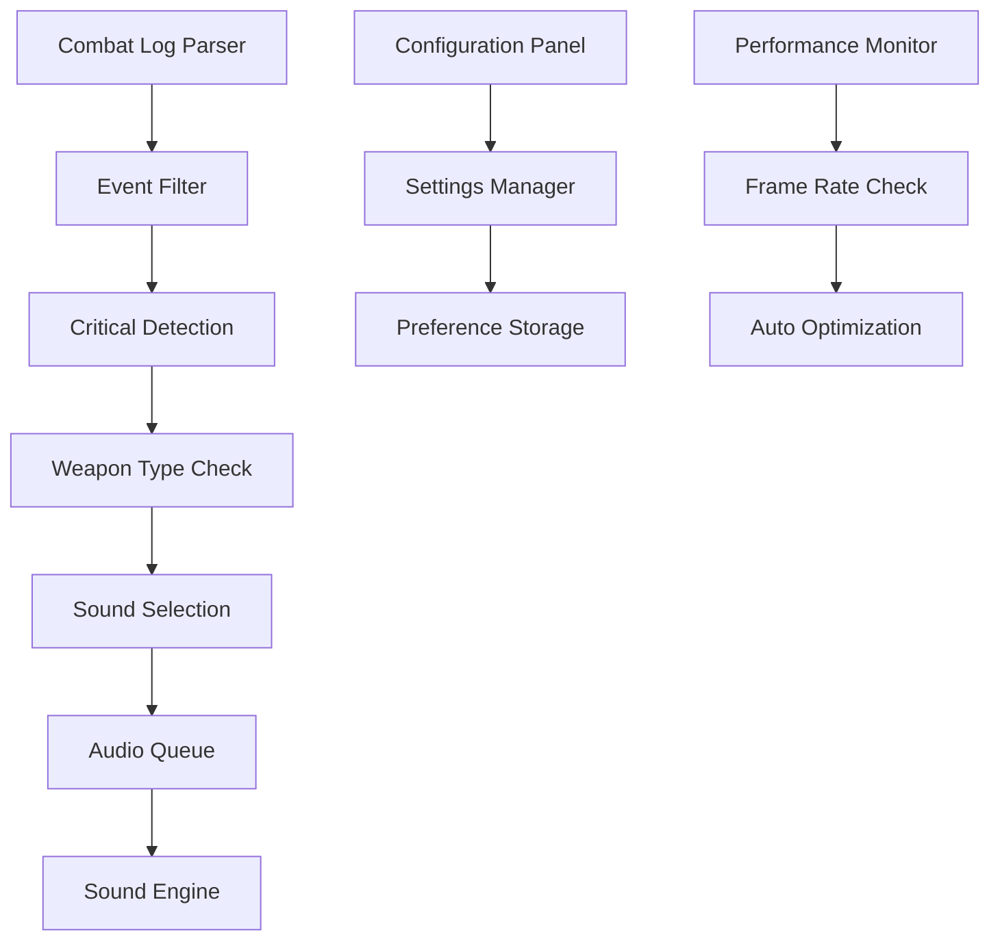

# ⚔️ WoW Lightsaber Addon

[← Volver al portafolio](../)

## 📋 Descripción del Proyecto

**Addon inmersivo para World of Warcraft Classic** que transforma la experiencia de combate reemplazando los sonidos de golpes críticos por efectos épicos de sable de luz. El addon utiliza detección avanzada de eventos de combate y optimización runtime para una experiencia fluida.

## ✨ Características Principales

### ⚔️ Sistema de Audio Avanzado
- **Reemplazo dinámico de sonidos** - Sustituye efectos de críticos por sonidos de sable láser
- **Detección de dual wield** - Diferentes sonidos para cada mano en combate dual
- **Detección de procs** - Activación especial en habilidades procedurales
- **Sistema de cooldown** - Evita spam de sonidos en combate intenso

### 🎮 Integración con WoW API
- **Event hooks optimizados** - Uso eficiente de la API de eventos de WoW
- **Parsing de combat log** - Análisis inteligente del registro de combate
- **Detección de weapon types** - Diferentes efectos según tipo de arma
- **Performance monitoring** - Optimización automática para evitar lag

### 🔧 Configuración Avanzada
- **Panel de configuración** in-game con opciones personalizables
- **Múltiples packs de sonido** - Diferentes estilos de sable láser
- **Filtros de clase** - Configuración específica por clase de personaje
- **Volume control** - Control independiente del volumen del addon

## 🛠️ Stack Tecnológico

```lua
-- Tecnologías y APIs utilizadas
WOW_APIS = {
    "Combat Log Events",
    "Sound System API", 
    "Event Registration",
    "Frame Management",
    "UI Configuration"
}

OPTIMIZATION_TECHNIQUES = {
    "Event Throttling",
    "Memory Management",
    "Lazy Loading",
    "Performance Profiling",
    "Runtime Optimization"
}

FEATURES = {
    "Dual Wield Detection",
    "Proc Recognition", 
    "Critical Hit Parsing",
    "Audio Queue Management",
    "Configuration Persistence"
}
```

## 🎯 Mecánicas del Addon

### **1. Event Detection System**
```lua
-- Ejemplo de detección de eventos críticos
local function OnCombatLogEvent(self, event, ...)
    local timestamp, subevent, _, sourceGUID, sourceName, _, _, 
          destGUID, destName, _, _, spellId, spellName, _, 
          amount, overkill, school, resisted, blocked, absorbed, 
          critical = CombatLogGetCurrentEventInfo()
    
    if critical and sourceGUID == UnitGUID("player") then
        PlayLightsaberSound(spellId, amount)
    end
end
```

### **2. Dual Wield Recognition**
El addon detecta automáticamente:
- **Main Hand Critical** - Sonido de sable azul
- **Off Hand Critical** - Sonido de sable rojo  
- **Spell Critical** - Sonido de fuerza especial
- **Ranged Critical** - Sonido de blaster

### **3. Performance Optimization**
- **Event pooling** para evitar memory leaks
- **Sound queue** para gestión de múltiples efectos
- **Frame rate monitoring** para ajuste automático
- **Lazy initialization** de recursos de audio

## 📊 Arquitectura del Addon



## 🎮 Experiencia de Usuario

### **Combate Inmersivo**
- Cada golpe crítico se siente épico con sonidos de sable láser
- Diferentes tonos para distintos tipos de daño
- Efectos especiales para habilidades únicas de cada clase

### **Configuración Intuitiva**
- Panel accesible desde el menú de interface
- Presets predefinidos para diferentes estilos de juego
- Configuración por personaje y compartida por cuenta

### **Compatibilidad**
- **WoW Classic** compatible al 100%
- **Burning Crusade Classic** soporte completo
- **Wrath Classic** optimizado para nuevas mecánicas

## 🔧 Instalación

### **Método Manual**
```bash
# Descargar desde GitHub
git clone https://github.com/4rgs/LightsaberCrit.git

# Copiar a carpeta de addons
cp -r LightsaberCrit/ "World of Warcraft/_classic_/Interface/AddOns/"
```

### **Via CurseForge/Wago**
1. Buscar "Lightsaber Crit" en tu cliente de addons
2. Instalar automáticamente
3. Reiniciar WoW Classic

## ⚙️ Configuración Avanzada

### **Comandos de Chat**
```lua
/lightsaber toggle          -- Activar/desactivar addon
/lightsaber volume [0-100]  -- Ajustar volumen
/lightsaber config          -- Abrir panel de configuración
/lightsaber reset           -- Restaurar configuración
```

### **Personalización de Sonidos**
El addon permite reemplazar los archivos de audio con tus propios sonidos:
```
AddOns/LightsaberCrit/Sounds/
├── mainhand_crit.ogg
├── offhand_crit.ogg
├── spell_crit.ogg
└── ranged_crit.ogg
```

## 🎯 Roadmap

- [ ] **Soporte para Retail WoW** - Adaptación para versión actual
- [ ] **Efectos visuales** - Partículas de sable láser en pantalla
- [ ] **Más packs de sonido** - Diferentes universos (Star Trek, etc.)
- [ ] **Integración con WeakAuras** - Triggering de auras personalizadas
- [ ] **Sound randomization** - Múltiples variantes por tipo de crítico

## 🏆 Reconocimiento

- **⭐ 1 star** en GitHub
- **Comunidad activa** de usuarios en Classic WoW
- **Compatible con streamers** - No interfiere con copyright de streaming

## 🔗 Enlaces

- **[📁 Repositorio GitHub](https://github.com/4rgs/LightsaberCrit)**
- **[📥 Descargar Latest Release](https://github.com/4rgs/LightsaberCrit/releases)**
- **[🐛 Reportar Bugs](https://github.com/4rgs/LightsaberCrit/issues)**
- **[📖 Wiki & Documentation](https://github.com/4rgs/LightsaberCrit/wiki)**

## 🏷️ Tags

`#WoW` `#Lua` `#Gaming` `#Addon` `#WorldOfWarcraft` `#Classic` `#Audio` `#StarWars` `#API` `#GameDev`

---

[← Volver al portafolio](../) | [🔗 Ver en GitHub](https://github.com/4rgs/LightsaberCrit)