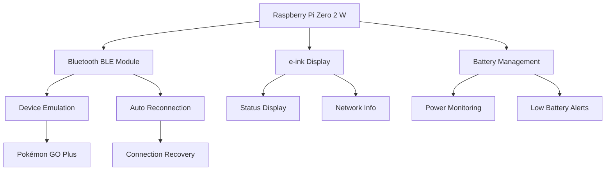

<div class="site-nav">
  <a href="../">🏠 Home</a>
  <a href="../about.html">👨‍💻 Sobre mí</a>
  <a href="../#proyectos-destacados">📁 Proyectos</a>
  <a href="../#contacto">📫 Contacto</a>
  <a href="https://github.com/4rgs" target="_blank">🐙 GitHub</a>
</div>

# 🧩 SpidsZero / RPI2WZeroLAB

[← Volver al portafolio](../)

## 📋 Descripción del Proyecto

**Sistema embebido avanzado basado en Raspberry Pi Zero 2 W** que integra múltiples tecnologías para crear un dispositivo personalizado tipo "Pwnagotchi". El proyecto combina hardware de bajo consumo con software inteligente para gestión de sistema y emulación de periféricos.

## ✨ Características Principales

### 🔷 Hardware Integration
- **Raspberry Pi Zero 2 W** como cerebro principal
- **Pantalla e-ink** para visualización de bajo consumo
- **Módulo Bluetooth BLE** para conectividad inalámbrica
- **Gestión de batería** inteligente con monitoreo

### 🔷 Funcionalidades del Sistema
- **Emulación de Pokémon GO Plus** - Dispositivo BLE que simula el periférico oficial
- **Monitor de red** - Visualización en tiempo real del estado de conectividad
- **Indicador de batería** - Monitoreo y alerta de niveles de energía
- **Reconexión automática** - Sistema robusto de reconexión Bluetooth
- **Interfaz visual** - Dashboard informativo en pantalla e-ink

### 🔷 Arquitectura de Software
- **Servicios systemd** para ejecutión automática
- **Python asyncio** para manejo concurrente de tareas
- **Gestión de eventos** Bluetooth de bajo nivel
- **Sistema de logging** robusto para debugging

## 🛠️ Stack Tecnológico

```python
# Tecnologías principales
HARDWARE = [
    "Raspberry Pi Zero 2 W",
    "e-ink Display",
    "Bluetooth Low Energy",
    "Battery Management System"
]

SOFTWARE = [
    "Python 3.9+",
    "BlueZ Stack",
    "systemd Services", 
    "asyncio Framework",
    "GPIO Control Libraries"
]

PROTOCOLS = [
    "Bluetooth Low Energy (BLE)",
    "SPI/I2C Communication",
    "UART Serial",
    "GPIO Digital Control"
]
```

## 🚀 Casos de Uso

### **1. Pokémon GO Plus Emulation**
El dispositivo puede emular completamente un Pokémon GO Plus oficial, permitiendo:
- Captura automática de Pokémon
- Recolección de items en PokéStops
- Notificaciones visuales en pantalla e-ink

### **2. Network Monitoring Device**
Funciona como monitor de red portátil mostrando:
- Estado de conectividad WiFi
- Calidad de señal
- Estadísticas de uso de datos
- Alertas de conectividad

### **3. Portable System Controller**
Actúa como controlador de sistema remoto:
- Gestión de servicios del sistema
- Monitoreo de recursos
- Control de dispositivos conectados

## 📊 Arquitectura del Sistema



## 🔧 Instalación y Configuración

### Prerrequisitos
```bash
# Dependencias del sistema
sudo apt update
sudo apt install python3-pip bluez bluetooth python3-dev

# Dependencias Python
pip3 install -r requirements.txt
```

### Configuración del Servicio
```bash
# Clonar repositorio
git clone https://github.com/4rgs/RPI2WZeroLAB.git
cd RPI2WZeroLAB

# Configurar servicio systemd
sudo cp spidszero.service /etc/systemd/system/
sudo systemctl enable spidszero.service
sudo systemctl start spidszero.service
```

## 🎯 Roadmap y Mejoras Futuras

- [ ] **Soporte multi-dispositivo** - Emulación de múltiples periféricos BLE
- [ ] **Interface web** - Panel de control accesible vía WiFi
- [ ] **Machine Learning** - Detección automática de patrones de uso
- [ ] **Expansión de sensores** - Integración de sensores ambientales
- [ ] **Mobile App** - Aplicación companion para Android/iOS

## 🔗 Enlaces

- **[📁 Repositorio GitHub](https://github.com/4rgs/RPI2WZeroLAB)**
- **[📚 Documentación técnica](https://github.com/4rgs/RPI2WZeroLAB/wiki)**
- **[🐛 Reportar Issues](https://github.com/4rgs/RPI2WZeroLAB/issues)**

## 🏷️ Tags

`#RaspberryPi` `#Python` `#Bluetooth` `#e-ink` `#IoT` `#Embedded` `#Hardware` `#Automation` `#BLE` `#Systemd`

---

[← Volver al portafolio](../) | [🔗 Ver en GitHub](https://github.com/4rgs/RPI2WZeroLAB)