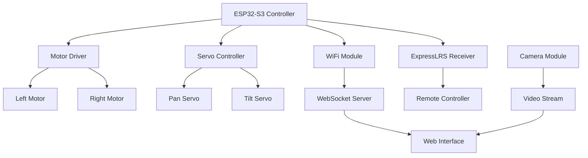

# 🛠️ T100 Controller

[← Volver al portafolio](../)

## 📋 Descripción del Proyecto

**Sistema de control remoto avanzado para tanque RC T100** que integra ESP32-S3, tecnología ExpressLRS y control de cámaras servo. El proyecto proporciona control completo de motores duales, servos de cámara y telemetría en tiempo real a través de WebSockets.

## ✨ Características Principales

### 🎮 Control Remoto Avanzado
- **Motores duales independientes** - Control diferencial para maniobras precisas
- **Sistema servo de cámara** - Pan/Tilt con 180° de movimiento
- **ExpressLRS integration** - Comunicación de baja latencia y largo alcance
- **Control PWM preciso** - Modulación de ancho de pulso para control suave

### 📡 Comunicación y Telemetría
- **WebSocket bidireccional** - Comunicación en tiempo real
- **Telemetría completa** - Voltaje de batería, temperatura, señal RF
- **Stream de video** - Transmisión en vivo desde cámara montada
- **Control remoto via WiFi** - Interface web para control desde cualquier dispositivo

### 🔧 Hardware Integration
- **ESP32-S3** como controlador principal
- **Driver de motores H-Bridge** para control de potencia
- **Servos digitales** para movimiento de cámara
- **Sensores de telemetría** integrados

## 🛠️ Stack Tecnológico

```python
# Arquitectura del sistema
HARDWARE_STACK = {
    "microcontroller": "ESP32-S3",
    "motors": "Dual H-Bridge Driver",
    "servos": "Digital Servo Motors",
    "communication": "ExpressLRS + WiFi",
    "camera": "ESP32-CAM Module",
    "power": "LiPo Battery Management"
}

SOFTWARE_STACK = {
    "backend": "Python WebSocket Server",
    "embedded": "C++ Arduino Framework", 
    "frontend": "HTML5 + JavaScript",
    "protocols": ["WebSocket", "PWM", "SPI", "I2C"],
    "libraries": ["AsyncWebSocket", "Servo", "WiFi"]
}
```

## 🎯 Arquitectura del Sistema

### **1. Control de Motores**
```python
# Ejemplo de control diferencial
class TankController:
    def __init__(self):
        self.left_motor = PWMController(pin_left)
        self.right_motor = PWMController(pin_right)
    
    def move_forward(self, speed):
        self.left_motor.set_speed(speed)
        self.right_motor.set_speed(speed)
    
    def turn_left(self, speed, turn_rate):
        self.left_motor.set_speed(speed - turn_rate)
        self.right_motor.set_speed(speed + turn_rate)
```

### **2. Sistema de Cámaras**
```cpp
// Control de servos para cámara
class CameraController {
    private:
        Servo panServo;
        Servo tiltServo;
        
    public:
        void setPanAngle(int angle) {
            panServo.write(constrain(angle, 0, 180));
        }
        
        void setTiltAngle(int angle) {
            tiltServo.write(constrain(angle, 0, 180));
        }
};
```

### **3. WebSocket Communication**
```javascript
// Cliente WebSocket para control
class T100Client {
    constructor(url) {
        this.ws = new WebSocket(url);
        this.setupEventHandlers();
    }
    
    sendCommand(command, data) {
        this.ws.send(JSON.stringify({
            type: command,
            data: data,
            timestamp: Date.now()
        }));
    }
}
```

## 📊 Diagrama de Sistema



## 🎮 Interface de Control

### **Web Dashboard**
- **Joystick virtual** - Control táctil para dispositivos móviles
- **Camera controls** - Botones para pan/tilt de cámara
- **Telemetry display** - Información en tiempo real del vehículo
- **Settings panel** - Configuración de sensibilidad y límites

### **Physical Controller**
- **ExpressLRS transmitter** compatible
- **Dual stick control** - Movimiento y cámara independientes
- **Switch assignments** - Funciones auxiliares configurables
- **Telemetry feedback** - Información mostrada en transmisor

## 🔋 Gestión de Energía

### **Sistema de Batería**
```python
class PowerManager:
    def __init__(self):
        self.voltage_pin = ADC_PIN
        self.low_voltage_threshold = 3.3  # Por celda
        
    def get_battery_voltage(self):
        raw = analogRead(self.voltage_pin)
        return (raw * 3.3 * voltage_divider) / 4095
        
    def check_low_voltage(self):
        if self.get_battery_voltage() < self.low_voltage_threshold:
            self.trigger_low_voltage_alarm()
```

### **Optimización de Consumo**
- **Sleep modes** cuando no está en uso
- **PWM efficiency** - Optimización de frecuencias
- **Dynamic power scaling** - Reducción de potencia en función de carga
- **Low voltage protection** - Apagado automático para proteger batería

## 📡 Protocolos de Comunicación

### **ExpressLRS Integration**
- **Ultra-low latency** - <10ms de lag en comandos críticos
- **Long range** - Hasta 30km de alcance en condiciones óptimas
- **Frequency hopping** - Resistencia a interferencias
- **Telemetry downlink** - Datos del vehículo al transmisor

### **WiFi WebSocket**
- **Real-time control** - Comandos instantáneos via web
- **Video streaming** - H.264 stream desde cámara
- **Bidirectional data** - Telemetría y comandos
- **Multi-client support** - Múltiples observadores simultáneos

## 🛡️ Sistemas de Seguridad

### **Failsafe Mechanisms**
```cpp
class FailsafeSystem {
    private:
        unsigned long lastCommandTime;
        const unsigned long TIMEOUT_MS = 1000;
        
    public:
        void checkTimeout() {
            if (millis() - lastCommandTime > TIMEOUT_MS) {
                stopAllMotors();
                centerAllServos();
                triggerFailsafeMode();
            }
        }
};
```

### **Protecciones Implementadas**
- **Communication timeout** - Parada automática sin señal
- **Over-current protection** - Protección de motores
- **Temperature monitoring** - Throttling por temperatura
- **Geofencing** - Límites virtuales de operación

## 🎯 Casos de Uso

### **Exploración y Reconocimiento**
- Navegación en terrenos difíciles
- Exploración de espacios estrechos
- Inspección visual remota

### **Entretenimiento y Hobby**
- Carreras de tanques RC
- Simulaciones de combate
- Demostraciones técnicas

### **Desarrollo y Testing**
- Plataforma de pruebas para algoritmos
- Testbed para sensores adicionales
- Prototipado de sistemas autónomos

## 🔧 Setup e Instalación

### **Hardware Assembly**
```bash
# Lista de componentes necesarios
ESP32-S3 DevKit
Dual Motor Driver (L298N)
2x Servo Motors (SG90 o similar)
Tank Chassis T100
ExpressLRS Receiver
ESP32-CAM Module
LiPo Battery (2S/3S)
```

### **Software Installation**
```bash
# Clonar repositorio
git clone https://github.com/4rgs/T100_Controler.git
cd T100_Controler

# Configurar entorno Arduino
pip install platformio
pio run --target upload

# Servidor Python
pip install -r requirements.txt
python server.py
```

## 📈 Roadmap y Mejoras

- [ ] **Autonomous navigation** - Integración de sensores LIDAR/ultrasónicos
- [ ] **AI integration** - Reconocimiento de objetos via cámara
- [ ] **Multi-vehicle support** - Control de múltiples unidades
- [ ] **Recording system** - Grabación de rutas y comandos
- [ ] **Mobile app** - Aplicación nativa para iOS/Android

## 🔗 Enlaces

- **[📁 Repositorio GitHub](https://github.com/4rgs/T100_Controler)**
- **[📚 Documentación de Setup](https://github.com/4rgs/T100_Controler/wiki)**
- **[🎥 Videos de Demostración](https://github.com/4rgs/T100_Controler/tree/main/demos)**
- **[🐛 Reportar Issues](https://github.com/4rgs/T100_Controler/issues)**

## 🏷️ Tags

`#ESP32` `#Python` `#RC` `#WebSocket` `#ExpressLRS` `#Servo` `#Motors` `#IoT` `#Embedded` `#Robotics`

---

[← Volver al portafolio](../) | [🔗 Ver en GitHub](https://github.com/4rgs/T100_Controler)